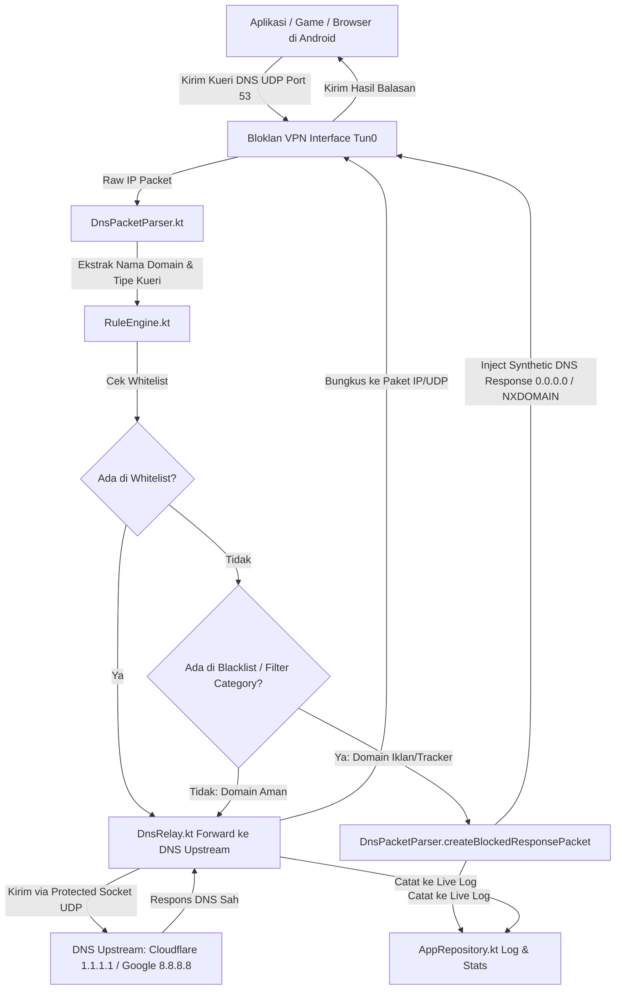

# 🛡️ Bloklan - System-Wide Local DNS Sinkhole & Ad-Free Media Player

**Bloklan** adalah aplikasi Android open-source canggih yang dirancang untuk memblokir iklan, pelacak (trackers), malware, dan telemetri OEM di seluruh sistem Android tanpa memerlukan akses *Root*. Bloklan menggabungkan teknologi **Local VPN DNS Sinkhole** dengan **Ad-Free Media Player (ExoPlayer & Invidious)** untuk memberikan pengalaman browsing dan streaming yang cepat, hemat kuota, dan sepenuhnya privat.

---

## 📋 Daftar Isi
1. [Fitur Utama](#-fitur-utama)
2. [Cara Kerja Sistem (Architecture Overview)](#-cara-kerja-sistem)
3. [Struktur Folder & Komponen Kode](#-struktur-folder--komponen-kode)
4. [Penjelasan Modul Kode (Codebase Breakdown)](#-penjelasan-modul-kode)
5. [Spesifikasi Teknis & Dependensi](#-spesifikasi-teknis--dependensi)
6. [Panduan Instalasi & Build](#-panduan-instalasi--build)
7. [Panduan Penggunaan Aplikasi](#-panduan-penggunaan-aplikasi)
8. [Privasi & Keamanan](#-privasi--keamanan)

---

## ✨ Fitur Utama

### 1. 🛡️ System-Wide DNS Sinkhole (Pemblokir Iklan Lokal)
- Berjalan di level sistem Android menggunakan `VpnService` lokal (IP virtual `10.10.10.1` / `10.10.10.2`).
- Mencegat seluruh kueri DNS UDP port 53 dari semua aplikasi (game, browser, media sosial).
- Memberikan respons instan **0.0.0.0** (A Record) atau **NXDOMAIN** untuk domain iklan tanpa membuang kuota internet.
- **100% Offline & Lokal:** Tidak ada data trafik browsing atau kueri pengguna yang dikirim ke server pihak ketiga.

### 2. ⚡ Live DNS Monitor & Audit Log
- Pemantauan kueri DNS secara *real-time* dengan latency (ms), timestamp, dan status (PASS / BLOCKED).
- Filter kueri berdasarkan: *Semua*, *Diblokir*, dan *Diizinkan*.
- Pencarian instan kueri domain.
- Aksi cepat satu-ketukan: Salin nama domain, tambahkan ke Whitelist, atau tambahkan ke Blacklist.

### 3. 🎯 Rule Engine & Kategori Filter Dinamis
- **Iklan & Pelacak**: Google Ads, DoubleClick, Unity Ads, AppLovin, IronSource, Vungle, Liftoff, Mintegral, ByteDance/Pangle, InMobi, Criteo, PopAds, dll.
- **Telemetri & Analitik**: OEM Telemetry (Xiaomi, Oppo, Vivo, Samsung, Huawei), Google Analytics, Firebase, Crashlytics, Adjust, AppsFlyer, Branch, Mixpanel.
- **Pelacak Media Sosial**: Facebook Pixel, TikTok Tracker, Twitter/X Analytics, Snapchat Tracker, LinkedIn Ads.
- **Malware & Phishing**: Perlindungan ancaman siber, redirect berbahaya, fake antivirus popups.
- **Custom Whitelist & Blacklist**: Tambah dan kelola domain kustom sendiri.

### 4. 🎬 Native Ad-Free YouTube Player (ExoPlayer + Invidious)
- Streaming video YouTube 100% bebas iklan tanpa integrasi Google Play Services.
- Didukung oleh **AndroidX Media3 ExoPlayer** untuk pemutaran video HLS & MP4 resolusi tinggi (hingga 720p/1080p).
- Fitur pencarian video, kategori trending, informasi channel, jumlah penonton, dan daftar rekomendasi video terkait.
- Multi-instance Invidious auto-failover untuk kehandalan tinggi.

### 5. 🌐 Web Player Ad-Blocking Browser
- Browser terintegrasi dengan engine penyaring request jaringan (`AdBlockWebViewClient`) dan injeksi script anti-iklan (`AdBlockScripts`).
- Mendukung desktop mode switch, bookmark cepat (YouTube, YT Music, Twitch, Dailymotion), dan bypass pop-up.

### 6. ⚙️ Konfigurasi Upstream DNS Fleksibel
- Pilihan DNS upstream terpercaya:
  - **Cloudflare DNS** (`1.1.1.1` / `1.0.0.1`)
  - **Google Public DNS** (`8.8.8.8` / `8.8.4.4`)
  - **Quad9 Security DNS** (`9.9.9.9` / `149.112.112.112`)
  - **AdGuard DNS** (`94.140.14.14` / `94.140.15.15`)

---

## 🏗️ Cara Kerja Sistem

Bloklan bekerja sebagai **Local Loopback DNS Proxy**. Alih-alih merutekan semua paket data keluar HP, Bloklan hanya mengarahkan rute kueri DNS ke antarmuka VPN lokal, memproses filter secara instan di memori HP, dan hanya meneruskan kueri yang sah ke DNS Upstream.



---

## 📂 Struktur Folder & Komponen Kode

```
c:/Dishub/experiment/bloklan/
├── app/
│   ├── build.gradle.kts          # Konfigurasi dependensi Android & Compose
│   └── src/main/
│       ├── AndroidManifest.xml   # Izin VPN, FOREGROUND_SERVICE, INTERNET
│       ├── java/com/bloklan/
│       │   ├── BloklanApp.kt     # Inisialisasi tingkat aplikasi
│       │   ├── MainActivity.kt   # Root Activity, Bottom Navigation, VPN Lifecycle
│       │   ├── core/
│       │   │   ├── dns/
│       │   │   │   ├── DnsPacketParser.kt  # Parser biner IPv4/UDP & DNS Builder
│       │   │   │   └── DnsRelay.kt         # Forwarder socket UDP ke upstream
│       │   │   ├── rules/
│       │   │   │   ├── DefaultRules.kt     # Database domain iklan & preset DNS
│       │   │   │   └── RuleEngine.kt       # Algoritma pencocokan domain hierarkis
│       │   │   ├── vpn/
│       │   │   │   └── BloklanVpnService.kt # Foreground VPN Service & Packet Loop
│       │   │   ├── web/
│       │   │   │   ├── AdBlockScripts.kt   # Script injeksi penghapus elemen iklan
│       │   │   │   └── AdBlockWebViewClient.kt # Interceptor request WebView
│       │   │   └── youtube/
│       │   │       ├── YouTubeExtractor.kt # Invidious API Client & Fallback
│       │   │       └── YouTubeModels.kt    # Data model video & format stream
│       │   ├── data/
│       │   │   ├── model/
│       │   │   │   └── Models.kt           # Entity DnsQueryLog, VpnStats, FilterCategory
│       │   │   └── repository/
│       │   │       └── AppRepository.kt    # Singleton Reactive StateFlow Repository
│       │   └── ui/
│       │       ├── screens/
│       │       │   ├── HomeScreen.kt          # Dashboard, toggle VPN, ringkasan metrik
│       │       │   ├── NativePlayerScreen.kt  # YouTube player ExoPlayer bebas iklan
│       │       │   ├── WebPlayerScreen.kt     # Browser ad-blocker WebView
│       │       │   ├── LogScreen.kt           # Real-time DNS query inspector
│       │       │   ├── RulesScreen.kt         # Manajemen kategori, whitelist & blacklist
│       │       │   └── SettingsScreen.kt      # Pemilihan Upstream DNS & Reset
│       │       └── theme/
│       │           ├── Color.kt               # Palet warna Dark Cyberpunk / Neon Green
│       │           ├── Theme.kt               # Setup MaterialTheme Jetpack Compose
│       │           └── Type.kt                # Typography Jetpack Compose
│       └── res/                               # Resource drawable, icon, values
├── docs/
│   └── ARCHITECTURE.md           # Dokumentasi teknis mendalam arsitektur kode
├── build.gradle.kts              # Root build script
├── settings.gradle.kts           # Gradle module settings
└── gradle.properties             # Konfigurasi JVM & AndroidX
```

---

## 🔍 Penjelasan Modul Kode

### 1. Lapisan Inti Jaringan (`com.bloklan.core.dns` & `com.bloklan.core.vpn`)
- **[BloklanVpnService.kt](file:///c:/Dishub/experiment/bloklan/app/src/main/java/com/bloklan/core/vpn/BloklanVpnService.kt)**:
  - Mengatur `VpnService.Builder` dengan MTU 1500, IP antarmuka `10.10.10.2/32`, rute DNS `10.10.10.1/32`.
  - Mengabaikan paket dari aplikasi sendiri (`addDisallowedApplication`) untuk mencegah loopback.
  - Menjalankan `runPacketLoop` di background Coroutine (`Dispatchers.IO`) membaca descriptor `FileInputStream`.
- **[DnsPacketParser.kt](file:///c:/Dishub/experiment/bloklan/app/src/main/java/com/bloklan/core/dns/DnsPacketParser.kt)**:
  - Membaca byte mentah paket IPv4, mengekstrak header IP (20 bytes), header UDP (8 bytes), dan payload DNS (RFC 1035).
  - Melakukan parsing DNS question section (QNAME, QTYPE, QCLASS).
  - Membangun paket balasan biner sintetis:
    - **Tipe A**: Flag `0x8580` (Authoritative Response, No Error) + A Record `0.0.0.0` (TTL 300 detik).
    - **Tipe Lain**: Flag `0x8183` (NXDOMAIN / Name Error).
  - Menghitung ulang IP Checksum (RFC 791).
- **[DnsRelay.kt](file:///c:/Dishub/experiment/bloklan/app/src/main/java/com/bloklan/core/dns/DnsRelay.kt)**:
  - Mengirim payload kueri DNS mentah ke IP upstream (misal `1.1.1.1:53`) menggunakan `DatagramSocket`.
  - Memanggil `vpnService.protect(socket)` agar socket UDP ini tidak terperangkap ke dalam antarmuka VPN sendiri.

### 2. Lapisan Aturan & Penyaringan (`com.bloklan.core.rules`)
- **[RuleEngine.kt](file:///c:/Dishub/experiment/bloklan/app/src/main/java/com/bloklan/core/rules/RuleEngine.kt)**:
  - Menggunakan struktur data *thread-safe* `CopyOnWriteArraySet` dan `ConcurrentHashMap`.
  - Menggunakan algoritma pencocokan subdomain bertingkat (misal: kueri `ad.sub.googleads.com` akan otomatis mencocokkan `sub.googleads.com` dan `googleads.com`).
  - Prioritas evaluasi: `1. Whitelist` -> `2. Custom Blacklist` -> `3. Kategori Filter Aktif`.
- **[DefaultRules.kt](file:///c:/Dishub/experiment/bloklan/app/src/main/java/com/bloklan/core/rules/DefaultRules.kt)**:
  - Berisi daftar puluhan ribu domain iklan mobile terpopuler, SDK analitik, pelacak media sosial, malware, dan daftar server DNS publik terbaik.

### 3. Lapisan Media Player & Web Ad-Block (`com.bloklan.core.youtube` & `com.bloklan.core.web`)
- **[YouTubeExtractor.kt](file:///c:/Dishub/experiment/bloklan/app/src/main/java/com/bloklan/core/youtube/YouTubeExtractor.kt)**:
  - Menghubungkan ke cluster Invidious API publik (`inv.nadeko.net`, `yewtu.be`, `invidious.nerdvpn.de`, dll.) dengan sistem fallback berputar.
  - Mengekstrak direct audio/video format MP4/HLS stream URLs tanpa iklan.
- **[AdBlockWebViewClient.kt](file:///c:/Dishub/experiment/bloklan/app/src/main/java/com/bloklan/core/web/AdBlockWebViewClient.kt)**:
  - Mencegat request URL di WebView sebelum dieksekusi.
  - Memblokir request ke endpoint iklan YouTube (`/pagead/`, `/api/stats/ads`, `doubleclick.net`, dll.) dengan mengembalikan respons HTTP kosong `WebResourceResponse`.
- **[AdBlockScripts.kt](file:///c:/Dishub/experiment/bloklan/app/src/main/java/com/bloklan/core/web/AdBlockScripts.kt)**:
  - Script JavaScript yang otomatis diinjeksikan untuk mematikan banner, pop-up, dan auto-skip video ads.

### 4. Lapisan Data & Reaktivitas (`com.bloklan.data`)
- **[AppRepository.kt](file:///c:/Dishub/experiment/bloklan/app/src/main/java/com/bloklan/data/repository/AppRepository.kt)**:
  - Mengelola *Single Source of Truth* untuk seluruh state aplikasi menggunakan `Kotlin StateFlow`.
  - Menyimpan antrean 200 kueri log DNS terakhir secara thread-safe menggunakan `LinkedList` sinkron.
  - Menghitung statistik total kueri, iklan diblokir, dan persentase efisiensi.

### 5. Lapisan Antarmuka Pengguna (`com.bloklan.ui`)
- Menggunakan **Jetpack Compose** dengan desain futuristik **Dark Cyberpunk Theme** (background gelap pekat `#0B0F19` dipadukan dengan aksen Neon Green `#00E676` dan Neon Cyan `#00B0FF`).
- **[HomeScreen.kt](file:///c:/Dishub/experiment/bloklan/app/src/main/java/com/bloklan/ui/screens/HomeScreen.kt)**: Tombol daya pulsasi dengan animasi putar halus, kartu metrik statistik, status filter, dan widget ringkasan kueri terbaru.
- **[NativePlayerScreen.kt](file:///c:/Dishub/experiment/bloklan/app/src/main/java/com/bloklan/ui/screens/NativePlayerScreen.kt)**: Tampilan feed video YouTube, search bar, chips kategori, dan integrasi `AndroidView` `PlayerView` ExoPlayer.
- **[LogScreen.kt](file:///c:/Dishub/experiment/bloklan/app/src/main/java/com/bloklan/ui/screens/LogScreen.kt)**: Live DNS Monitor dengan pencarian, filter status, dan dialog inspect kueri.
- **[RulesScreen.kt](file:///c:/Dishub/experiment/bloklan/app/src/main/java/com/bloklan/ui/screens/RulesScreen.kt)**: Switch on/off kategori filter dan manajemen tambah/hapus whitelist & blacklist kustom.
- **[SettingsScreen.kt](file:///c:/Dishub/experiment/bloklan/app/src/main/java/com/bloklan/ui/screens/SettingsScreen.kt)**: Radio selector DNS Upstream, reset data statistik, dan informasi privasi aplikasi.

---

## 🛠️ Spesifikasi Teknis & Dependensi

- **Min SDK**: API 24 (Android 7.0 Nougat)
- **Target SDK**: API 34 (Android 14)
- **Java / Kotlin Version**: Java 17 / Kotlin 1.9+
- **UI Toolkit**: Jetpack Compose (Material 3)
- **Media Player**: AndroidX Media3 ExoPlayer (`1.2.0`)
- **Networking**: OkHttp 4 (`4.12.0`)
- **Image Loader**: Coil Compose (`2.5.0`)
- **Asynchronous**: Kotlin Coroutines (`1.7.3`) & Flow

---

## 🚀 Panduan Instalasi & Build

### Prasyarat
1. Terpasang **Android Studio Hedgehog / Iguana / Jellyfish** atau lebih baru.
2. JDK 17 terkonfigurasi pada `JAVA_HOME`.
3. Android SDK Build-Tools & Platform API 34.

### Langkah Build Melalui Terminal (Command Line)
```bash
# Clone repository jika diperlukan
git clone https://github.com/your-repo/bloklan.git
cd bloklan

# Build APK mode Debug
./gradlew assembleDebug

# Output APK akan berada di:
# app/build/outputs/apk/debug/app-debug.apk
```

### Menjalankan ke Perangkat / Emulator
```bash
./gradlew installDebug
```

---

## 📖 Panduan Penggunaan Aplikasi

1. **Mengaktifkan Proteksi Iklan**:
   - Buka aplikasi Bloklan.
   - Pada halaman **Beranda**, ketuk tombol daya besar di tengah layar.
   - Jika pertama kali, sistem Android akan meminta izin *"VPN Connection Request"*. Tekan **OK / Izinkan**.
   - Ikon status akan berubah menjadi **PROTECTED** dengan lampu neon hijau aktif.
2. **Menonton Video YouTube Tanpa Iklan**:
   - Buka tab **Player** di menu navigasi bawah.
   - Ketik judul video di kotak pencarian atau pilih kategori video yang diinginkan.
   - Ketuk thumbnail video untuk memutar langsung menggunakan native ExoPlayer tanpa jeda iklan.
3. **Memantau Aktivitas DNS & Mengatur Rule**:
   - Buka tab **Monitor** untuk melihat kueri jaringan secara langsung.
   - Jika ada domain yang salah diblokir atau ingin diblokir khusus, ketuk domain tersebut dan pilih **Izinkan (Whitelist)** atau **Blokir Domain (Blacklist)**.
4. **Mengubah Server DNS Upstream**:
   - Buka tab **Pengaturan**.
   - Pilih server DNS favorit Anda (misal: Cloudflare atau AdGuard DNS).

---

## 🔒 Privasi & Keamanan

- **Zero-Logging Server**: Bloklan tidak memiliki server backend pengumpul data. Semua penyaringan terjadi di perangkat Anda.
- **Tanpa Root**: Menggunakan API resmi Android `VpnService` sehingga aman untuk garansi perangkat dan tidak merusak sistem operasi.
- **Transparansi Penuh**: Seluruh kode sumber terbuka untuk diaudit secara independen.

---

*Dikembangkan dengan ❤️ untuk kebebasan, privasi, dan kenyamanan berselancar di internet.*
